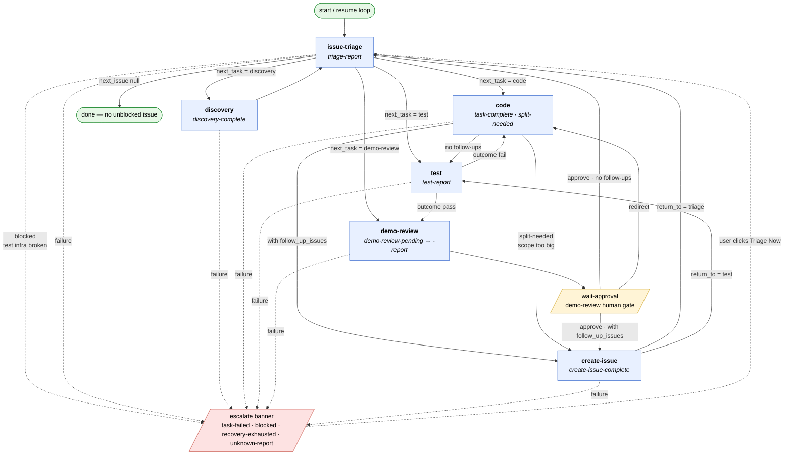

# Autonomous Product Team

An autonomous AI product team that runs on [Synthup](https://www.synthup.dev). A Ruby orchestrator picks up the highest-priority unblocked issue, implements it, tests it, and presents a PR for user approval — then loops. Synthup manages the sessions that execute each task.

This repo *is* the app: clone it, run `./bin/start`, configure via the web UI. No npm, no copy-into-your-project step. Tasks live in `tasks/` and are read in place.

## Prerequisites

| Tool | Required version | Notes |
|---|---|---|
| Ruby | ≥ 3.0 | Older versions fail to resolve `sinatra 4.x` and `puma 8.x`. |
| Bundler | ≥ 2.0 | Bundler ships with modern Ruby; `gem install bundler` if missing. |
| [Synthup](https://synthup.dev) account | — | Needed for the `tenant` and `api_key` configured in the web UI. |

Windows is not officially supported — use [WSL2](https://learn.microsoft.com/en-us/windows/wsl/install).

## Quick start

```bash
git clone https://github.com/alysonbasilio/autonomous-product-team.git
cd autonomous-product-team
./bin/start
```

`bin/start` runs `bundle install` if needed, then boots the orchestrator. Open `http://localhost:4242`:

1. Enter your Synthup `tenant` and `api_key` under **Global Config**.
2. Add a project: paste the URL of your issues list (e.g. `https://linear.app/your-team/issues`) and optionally a `local_path`.
3. The first project becomes active automatically. The orchestrator starts dispatching `issue-triage.md` against it.

Stop with Ctrl-C; restart with `./bin/start`. State is persisted under `data/` and survives restarts.

## Configuration

| Env var | Purpose |
|---|---|
| `SYNTHUP_TENANT` | Override the tenant from `data/config.json`. When set, the UI hides the field. |
| `SYNTHUP_API_KEY` | Override the api key from `data/config.json`. When set, the UI hides the field. |
| `ORCHESTRATOR_PORT` | Web UI port (default `4242`). |
| `ORCHESTRATOR_INTERACTIVE` | Set to `1` to pause for approval before every routed action. |
| `ORCHESTRATOR_DATA_DIR` | Override the data root (default `data/` next to the repo). |

### Data layout

```
data/
├── config.json                  # global Synthup creds + active_project_id
└── projects/<slug>.json         # one file per configured project
```

`<slug>` is derived deterministically from `project_url` (e.g. `https://linear.app/acme/issues` → `linear-acme-issues`). Re-adding the same URL re-binds the existing state file.

## How it works

### Components

- **Orchestrator** — Ruby process (`orchestrator/run.rb`) that drives the lifecycle loop. Routes between tasks based on their JSON output.
- **Task** — A Markdown prompt file in `tasks/` defining one step of the workflow (e.g. `issue-triage.md`, `code.md`). Each task specifies a model in its frontmatter.
- **Session** — A Synthup-managed execution that runs a task prompt and outputs a structured JSON report. The orchestrator polls for the report and routes to the next task.
- **Project state** — `data/projects/<slug>.json`. Tracks the active session and history per project; enables crash-safe resume.

### Lifecycle

Happy path:

```
triage → code → test → demo-review → [user approves + merges] → triage → …
```

The orchestrator dispatches one task at a time. Each task runs as a Synthup session and signals completion by outputting a JSON report. The orchestrator reads the report and dispatches the next task automatically.

Demo review is the one human gate: the orchestrator pauses and presents the PR in the web UI. The user approves or redirects — the orchestrator never merges.

Full routing graph (every transition defined in [`orchestrator/router.rb`](orchestrator/router.rb)):



Legend: solid arrows are normal routing on JSON reports; dashed arrows are failure paths. `issue-triage` is the central decision-maker — every loop comes back through it. The yellow `wait-approval` node is the only place the loop pauses for a human.

### Behavior

1. Works on **one issue at a time** for the active project — the highest-priority unblocked issue.
2. **The user owns the merge.** Demo review presents the PR in the web UI and waits.
3. **Tasks are idempotent.** Each task posts a structured JSON comment to the PM issue on completion. On restart, `issue-triage.md` reads these comments to determine what has already been done.
4. **Sessions resume after a crash.** The active session ID is saved before polling. On restart, the orchestrator resumes polling the existing session.
5. **A branch is created per issue and cleaned up automatically.** `issue-triage.md` derives a branch name per issue; the code task creates and pushes it. Each Synthup session checks out that branch at the start. After the PR merges, the next triage cycle deletes the local branch.

The orchestrator never `cd`s into your project on disk — all git/file work happens inside the Synthup session against the GitHub repo derived from `project_url`.

## Web UI

The orchestrator UI at `http://localhost:4242` lets you:

- **Switch viewed project** — header dropdown. All projects run in parallel; this only changes which one's panel you see.
- **Pause / Resume** — stop the viewed project's loop between tasks without killing the process. Other projects keep running.
- **Triage Now** — force an immediate re-triage on the viewed project (useful after manually resolving a blocker).
- **Cancel** — abort the viewed project's current running task.
- **Approve / Redirect** — the approval gate for demo review. Approve records your consent and lets the project's loop move on; Redirect sends your feedback back through the code task.
- **Escalation banner** — shown when a task fails; includes error details and a Triage Now button to reset.

## Multiple projects

Every configured project runs **its own orchestration loop in parallel**. Add as many as you like; each project's state, history, and escalations are isolated in its own `data/projects/<slug>.json`. The header dropdown picks which project's panel the UI shows — switching the view does not pause anything.

Per-project controls (Pause, Triage Now, Cancel, Approve/Redirect) apply only to the project you're viewing. The project list badges each row (running / paused / awaiting / escalated / done) so you can tell at a glance when an unviewed project needs attention.

Synthup credentials are global: every project's loop uses the same `tenant` and `api_key`. Running N projects in parallel multiplies session creation against your Synthup quota — keep an eye on credit burn.

## Updating

```bash
git pull
./bin/start
```

If `bundle install` fails after a pull, see [Troubleshooting](#troubleshooting).

## Troubleshooting

### `Could not find puma-X, mustermann-X in locally installed gems`

Bundler couldn't resolve gems for your platform. Run `bundle install` directly to see the underlying error.

### Missing platform entry in `Gemfile.lock`

If `bundle install` complains your platform is unsupported (typical on a fresh Linux x86_64 clone of an older revision):

```bash
bundle lock --add-platform x86_64-linux   # or arm64-darwin for Apple Silicon
bundle install
```

### Ruby version mismatch

If `ruby --version` is below 3.0, pin a supported version locally with rbenv / asdf and re-run `bundle install`.

### Bundler version too old

```bash
gem install bundler
```

## Contributing

### Making changes

When modifying task definitions (`tasks/*.md`), run the test suite:

```bash
# Fast structural checks (no API key required)
bundle exec ruby tests/test_static.rb

# Full suite including LLM-as-judge evals (requires OPENROUTER_API_KEY in tests/.env)
bundle exec ruby tests/run.rb
```

### Setup

```bash
bundle install
echo "OPENROUTER_API_KEY=sk-or-..." > tests/.env
```

### Adding tests

| File | What to add |
|---|---|
| `tests/test_static.rb` | Structural checks — new fields, new task references, new report types |
| `tests/test_triage.rb` | New triage edge cases (blocker definitions, priority rules) |
| `tests/test_triage_routing.rb` | New routing table rows or state combinations (Phase 2 of triage) |
| `tests/test_demo_review.rb` | New demo-review scenarios or approval/redirect edge cases |
| `tests/test_discovery.rb` | New discovery scenarios or issue analysis edge cases |

Each LLM eval is a scenario hash with `:name`, `:description`, `:mock_context`, and `:rubric` — see any existing scenario in those files for the pattern.

### End-to-end test

`tests/e2e/` boots the orchestrator in interactive mode, drives it through a real browser, and walks the full `triage → code → test → demo-review` lifecycle against a configured GitHub repo.

```bash
bundle exec ruby tests/e2e/run.rb
```

Prereqs:

- Chrome or Chromium installed and on `$PATH` (Ferrum drives it via CDP — no Node toolchain).
- `gh` CLI authenticated for the sandbox repo.
- `tests/.env` populated:
  ```
  SYNTHUP_TENANT=...
  SYNTHUP_API_KEY=...
  E2E_GITHUB_REPO=owner/sandbox-repo
  ```

Optional: `E2E_PORT`, `E2E_TIMEOUT_S` (default `1800`), `E2E_HEADLESS=0` to run headed.

> **Warning:** this opens a real PR against `E2E_GITHUB_REPO` and burns Synthup credits. Always point it at a sandbox repo, never the canonical `alysonbasilio/autonomous-product-team`. The test closes the issue and PR in teardown, but a hard-killed run may leave artifacts.

See [AGENTS.md](AGENTS.md) for the testing directives — in particular, e2e tests assert on the rendered DOM only, never on `/api/*` responses.
