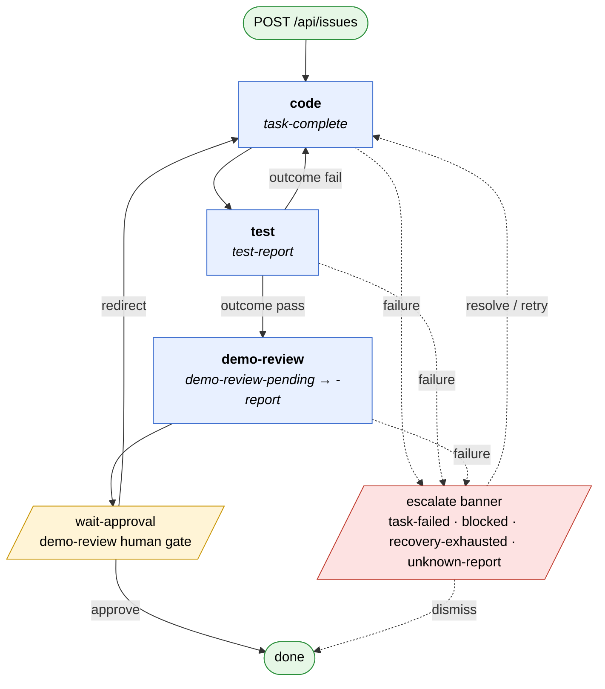

# Autonomous Product Team

An autonomous AI product team that runs on [Synthup](https://www.synthup.dev). Submit an issue and a GitHub repo — the orchestrator implements it, tests it, and presents a PR for your approval. Multiple issues run in parallel. Synthup manages the sessions that execute each task.

This repo *is* the app: clone it, run `./bin/start`, configure via the web UI. No npm, no copy-into-your-project step. Tasks live in `tasks/` and are read in place.

## Prerequisites

| Tool | Required version | Notes |
|---|---|---|
| Ruby | ≥ 3.0 | Older versions fail to resolve `sinatra 4.x` and `puma 8.x`. |
| Bundler | ≥ 2.0 | Bundler ships with modern Ruby; `gem install bundler` if missing. |
| [Synthup](https://synthup.dev) account | — | Needed for the `tenant` and `api_key` configured in the web UI. |

Windows is not officially supported — use [WSL2](https://learn.microsoft.com/en-us/windows/wsl/install).

## Quick start

```bash
git clone https://github.com/alysonbasilio/autonomous-product-team.git
cd autonomous-product-team
./bin/start
```

`bin/start` runs `bundle install` if needed, then boots the orchestrator. Open `http://localhost:4242`:

1. Enter your Synthup `tenant` and `api_key` under **Global Config**.
2. Click **New Issue**, paste a description and a GitHub repo URL, and submit.
3. The orchestrator immediately starts working on it: code → test → demo-review.

Stop with Ctrl-C; restart with `./bin/start`. State persists in `data/orchestrator.db` and survives restarts. In-progress sessions are resumed automatically on boot.

## Configuration

| Env var | Purpose |
|---|---|
| `SYNTHUP_TENANT` | Override the tenant from the database. When set, the UI hides the field. |
| `SYNTHUP_API_KEY` | Override the api key from the database. When set, the UI hides the field. |
| `PORT` / `ORCHESTRATOR_PORT` | Web UI port (default `4242`). `PORT` wins if both are set. |
| `ORCHESTRATOR_BIND` | Bind address (default `127.0.0.1`; set to `0.0.0.0` to expose). |
| `ORCHESTRATOR_USERNAME` | HTTP Basic Auth username (default `admin`). Only used if `ORCHESTRATOR_PASSWORD` is set. |
| `ORCHESTRATOR_PASSWORD` | HTTP Basic Auth password. Enables auth when non-empty; unset disables auth (local dev). |
| `ORCHESTRATOR_INTERACTIVE` | Set to `1` to pause for approval before every routed action. |
| `ORCHESTRATOR_DATA_DIR` | Override the data root (default `data/` next to the repo). |

For cloud deployment (Oracle Cloud Always Free + Cloudflare Quick Tunnel), see [docs/deploy-oracle-cloud.md](docs/deploy-oracle-cloud.md).

### Data layout

```
data/
└── orchestrator.db    # SQLite store — all issues, credentials, history
```

State persists in SQLite. Re-running `./bin/start` resumes any in-flight issues automatically.

## How it works

### Components

- **Orchestrator** — Ruby process (`orchestrator/run.rb`) that spawns one thread per issue and drives it through the task lifecycle.
- **Task** — A Markdown prompt file in `tasks/` defining one step of the workflow (`code.md`, `test.md`, `demo-review.md`). Each task specifies a model in its frontmatter.
- **Session** — A Synthup-managed execution that runs a task prompt and outputs a structured JSON report. The orchestrator polls for the report and routes to the next task.
- **Issue** — An `Issue` row in SQLite. Carries `input_text`, `repo_url`, `lifecycle_stage`, `current_task`, `escalation`, and a `history` JSON log of completed tasks.

### Lifecycle

```
code → test → demo-review → done
```

Each issue submitted via the web UI gets its own thread. The thread drives the issue through the task chain, polling Synthup for each task's JSON report and routing to the next task. Demo review is the only human gate.

Full routing graph (every transition defined in [`orchestrator/router.rb`](orchestrator/router.rb)):



Legend: solid arrows are normal routing on JSON reports; dashed arrows are failure paths. The yellow `wait-approval` node is the only place a thread pauses for a human.

### Behavior

1. **One thread per issue** — each issue runs its own task loop independently. Multiple issues make progress in parallel.
2. **The user owns the merge.** Demo review presents the PR in the web UI and waits.
3. **Sessions resume after a crash.** On restart, any issue whose session was active when the server stopped is automatically resumed by sending a recovery nudge.
4. **History is per-issue.** Each issue carries a JSON log of every completed task (task name, session ID, duration, report summary).

The orchestrator never `cd`s into your project on disk — all git/file work happens inside the Synthup session against the GitHub repo from `repo_url`.

## Web UI

The orchestrator UI at `http://localhost:4242` lets you:

- **Submit an issue** — New Issue button: paste a description and a GitHub repo URL.
- **Pause / Resume** — stop an issue's loop between tasks without killing the process.
- **Cancel** — abort an issue's current running task.
- **Delete** — remove a completed or cancelled issue from the list.
- **Approve / Redirect** — the approval gate for demo review. Approve marks the issue done; Redirect sends your feedback back through the code task. When multiple issues are awaiting approval, they queue — the UI shows the oldest first.
- **Escalation banner** — shown when a task fails; includes error details and a Retry / Dismiss button.

## Parallel issues

Every submitted issue runs **its own orchestration thread in parallel**. There is no per-project concept — issues are top-level. Each issue's state, history, and escalations are isolated in its own DB row.

Synthup credentials are global: every issue's thread uses the same `tenant` and `api_key`. Running many issues in parallel multiplies session creation against your Synthup quota — keep an eye on credit burn.

## Updating

```bash
git pull
./bin/start
```

If `bundle install` fails after a pull, see [Troubleshooting](#troubleshooting).

## Troubleshooting

### `Could not find puma-X, mustermann-X in locally installed gems`

Bundler couldn't resolve gems for your platform. Run `bundle install` directly to see the underlying error.

### Missing platform entry in `Gemfile.lock`

If `bundle install` complains your platform is unsupported (typical on a fresh Linux x86_64 clone of an older revision):

```bash
bundle lock --add-platform x86_64-linux   # or arm64-darwin for Apple Silicon
bundle install
```

### Ruby version mismatch

If `ruby --version` is below 3.0, pin a supported version locally with rbenv / asdf and re-run `bundle install`.

### Bundler version too old

```bash
gem install bundler
```

## Contributing

### Making changes

When modifying task definitions (`tasks/*.md`), run the test suite:

```bash
# Fast structural checks (no API key required)
bundle exec ruby tests/test_static.rb

# Full suite including LLM-as-judge evals (requires OPENROUTER_API_KEY in tests/.env)
bundle exec ruby tests/run.rb
```

### Setup

```bash
bundle install
echo "OPENROUTER_API_KEY=sk-or-..." > tests/.env
```

### Adding tests

| File | What to add |
|---|---|
| `tests/test_static.rb` | Structural checks — new fields, new task references, new report types |
| `tests/test_server.rb` | API endpoint tests (rack-test) |
| `tests/test_issues.rb` | Issue lifecycle unit tests |
| `tests/test_demo_review.rb` | Demo-review approve / redirect / follow-up scenarios |

Each LLM eval is a scenario hash with `:name`, `:description`, `:mock_context`, and `:rubric` — see any existing scenario in those files for the pattern.

### End-to-end test

`tests/e2e/` boots the orchestrator, drives it through a real browser, and walks the full `code → test → demo-review` lifecycle against a configured GitHub repo.

```bash
bundle exec ruby tests/e2e/run.rb
```

Prereqs:

- Chrome or Chromium installed and on `$PATH` (Ferrum drives it via CDP — no Node toolchain).
- `gh` CLI authenticated for the sandbox repo.
- `tests/.env` populated:
  ```
  SYNTHUP_TENANT=...
  SYNTHUP_API_KEY=...
  E2E_GITHUB_REPO=owner/sandbox-repo
  ```

Optional: `E2E_PORT`, `E2E_TIMEOUT_S` (default `1800`), `E2E_HEADLESS=0` to run headed.

> **Warning:** this opens a real PR against `E2E_GITHUB_REPO` and burns Synthup credits. Always point it at a sandbox repo, never the canonical `alysonbasilio/autonomous-product-team`. The test closes the issue and PR in teardown, but a hard-killed run may leave artifacts.

See [AGENTS.md](AGENTS.md) for the testing directives — in particular, e2e tests assert on the rendered DOM only, never on `/api/*` responses.
